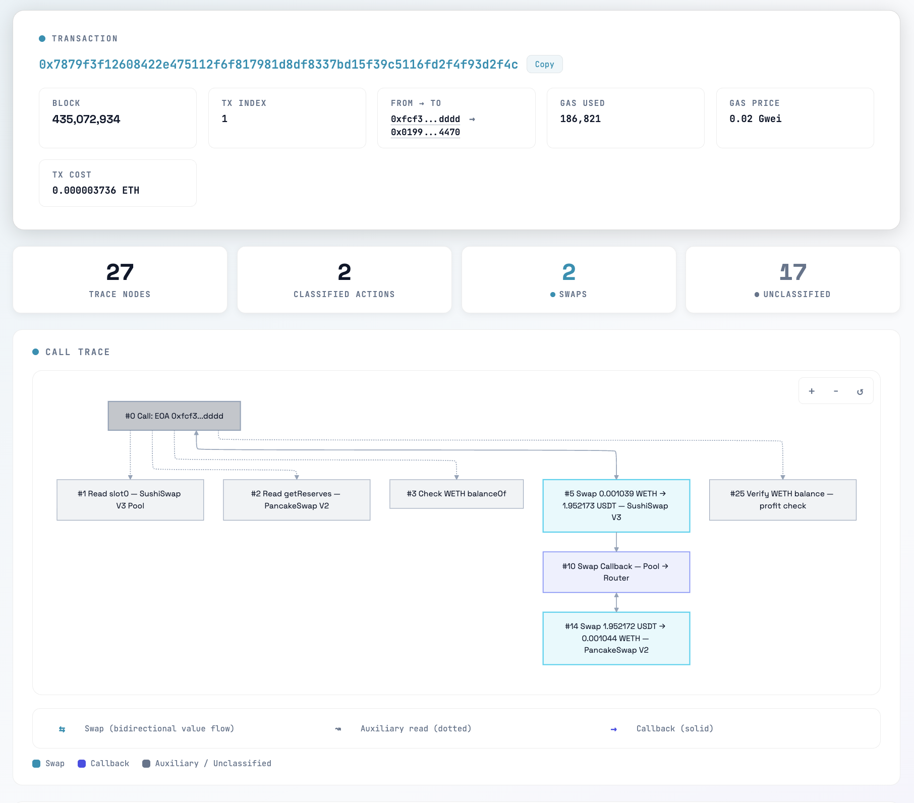
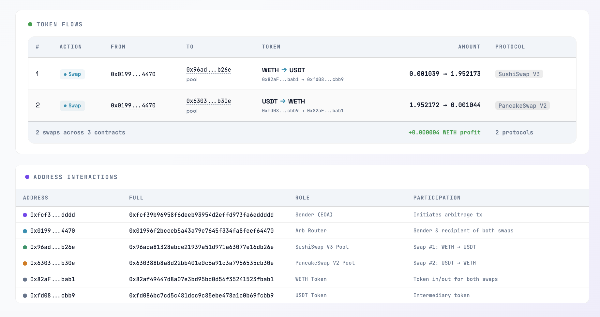

# EtherAgent

Analyze Ethereum transactions — fetches semantic trace data and generates an interactive HTML visualization of internal calls, token flows, and DeFi actions.

## Screenshots





## Install

```bash
npx skills add matrooslabs/etheragent
```

Or load directly in Claude Code:

```bash
claude --plugin-dir ./path/to/etheragent
```

## Usage

**Visual (HTML)** — opens an interactive page in your browser:
```
/visual-tx 0xTRANSACTION_HASH
```

**Trace (plain text)** — prints an ASCII art breakdown in the terminal:
```
/trace-tx 0xTRANSACTION_HASH
```

## License

MIT
